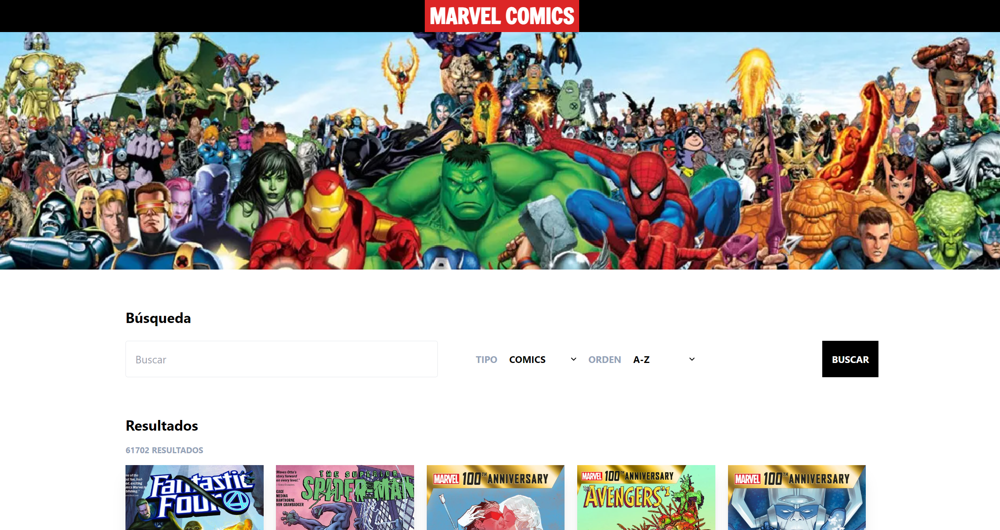

<h1>Comic ADA</h1>
<h3>Proyecto de Nerea Battauz Curso Frontend de ADA ITW </h3>
  

El proyecto consiste en la construcción de una página web que trae datos de la API de Marvel.
La misma permite visualizar comics y personajes de la base de datos, buscarlos por nombre, filtrarlos por tipo, ordenarlos por nombre o fecha. También se puede entrar en cada comic/personaje y visualizar la información del mismo.
También se hizo la paginación de los datos para poder navegar con facilidad.

